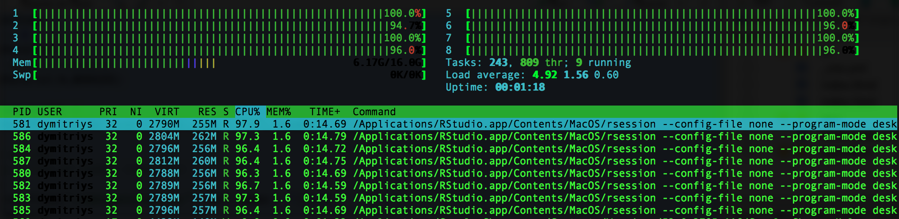

You've just discovered **[text2vec](https://github.com/dselivanov/text2vec)**!

**text2vec** is an R package which provides an efficient framework with a concise API for text analysis and natural language processing (NLP). 

Goals which we aimed to achieve as a result of development of `text2vec`:

* **Concise** - expose as few functions as possible
* **Consistent** - expose unified interfaces, no need to explore new interface for each task
* **Flexible** - allow to easily solve complex tasks
* **Fast** - maximize efficiency per single thread, transparently scale to multiple threads on multicore machines
* **Memory efficient** - use streams and iterators, not keep data in RAM if possible

See [API](http://text2vec.org/api.html) section for details.

# Performance

This package is efficient because it is carefully written in C++, which also means that text2vec is memory friendly. Some parts are fully parallelized using OpenMP. 

Other emrassingly parallel tasks (such as vectorization) can use any fork-based parallel backend on UNIX-like machines. They can achieve near-linear scalability with the number of available cores. 

Finally, a streaming API means that  users do not have to load all the data into RAM. 

# Contributing

The package has [issue tracker on GitHub](https://github.com/dselivanov/text2vec/issues) where I'm filing feature requests and notes for future work. Any ideas are appreciated.

Contributors are welcome. You can help by: 

- testing and leaving feedback on the [GitHub issuer tracker](https://github.com/dselivanov/text2vec/issues) (preferably) or directly by e-mail
- forking and contributing (check [code our style guide](https://github.com/dselivanov/text2vec/wiki/Code-style-guide)). Vignettes, docs, tests, and use cases are very welcome
- by giving me a star on [project page](https://github.com/dselivanov/text2vec) :-)

# License

GPL (>= 2)
